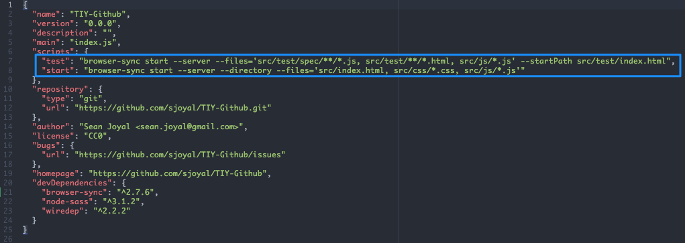

## Including Browser-Sync Scripts Within Package.json Files

Creating a `package.json` file within a project repo has many advantages. One of those advantages is the `scripts` section, which allows a developer to include various scripts to run on the command line and increase automation when working on a project.

For our purposes in class, we have initially used the scripts field for including some default commands to run browser-sync. The basic use of browser-sync is to run a local server for the current project that allows the user to work offline, and is initiated from the command line using the following command: `browser-sync start --server`. While that seems relatively painless, the command can become increasingly convoluted as more options are added for launch. For example, in order to launch the project directory, and watch select file paths (thus seeing automatic updates to your work on the local server), we would need the following command: `browser-sync start --server --directory --files='<filepath>'`. Typing that each time you begin work in a project sounds a little more messy. To automate the process, update the scripts field within `package.json` using the following steps:

1.) Create the `package.json` file by using the following command `npm init`
  * If you're confused on how to answer the questions presented after using `npm init`, just keep hitting enter. _Defaults never killed anybody_.

2.) Open `package.json` using the text editor of your choice

3.) Include a `start` script in the `scripts` section directly below the field for `main`:
  * `"start": "browser-sync start --server --directory --files='index.html'"`
  * In the example provided, a script is used to run a local server through browser-sync that starts on a directory listing and watches the file `index.html`.
  * For additional browser-sync options, refer to the [browser-sync documentation](http://www.browsersync.io/docs/command-line/)

4.) After saving the changes within `package.json`, the script can be run using `npm start` on the command line

Though I've used browser-sync in my example, many different scripts can be included to automate the yak-shaving process when beginning work on a project. For additional information on the predefined naming conventions for screipts, see the [npm documentation](https://docs.npmjs.com/misc/scripts).
